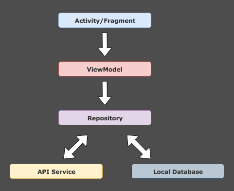

# Movies app
A simple Android application using MovieDB API, that helps user to discover movies.

 </br></br>

## Application architecture
Based on MVVM architecture and repository pattern



## Application specs
- Minimum SDK 21
- [Java8](https://java.com/en/download/faq/java8.xml)
- MVVM Architecture

## Installing

#### 1. Clone the repository by running the command below
```
git clone https://github.com/Elshad98/movies-app.git
```
#### 2. Import the project in AndroidStudio
1.  In Android Studio, go to File -> New -> Import project.
2.  Follew the dialog wizard to choose the folder where you cloned the project and click on open.
3.  Android Studio imports the projects and builds it for you.

## Dependencies

- [AndroidX](https://developer.android.com/jetpack/androidx "AndroidX")
- [Retrofit 2](https://github.com/square/retrofit "Retrofit 2")
- [Gson](https://github.com/google/gson "Gson")
- [RxJava 2](https://github.com/ReactiveX/RxJava "RxJava 2")
- [LiveData](https://developer.android.com/topic/libraries/architecture/livedata "LiveData")
- [ViewModel](https://developer.android.com/topic/libraries/architecture/viewmodel "ViewModel")
- [RoundedImageView](https://github.com/vinc3m1/RoundedImageView "RoundedImageView")
- [Toothpick](https://github.com/stephanenicolas/toothpick "Toothpick")
- [Glide](https://github.com/bumptech/glide "Glide")
- [FlexboxLayout](https://github.com/google/flexbox-layout "FlexboxLayout")
- [Paging](https://developer.android.com/topic/libraries/architecture/paging "Paging")

## Screenshots

        

